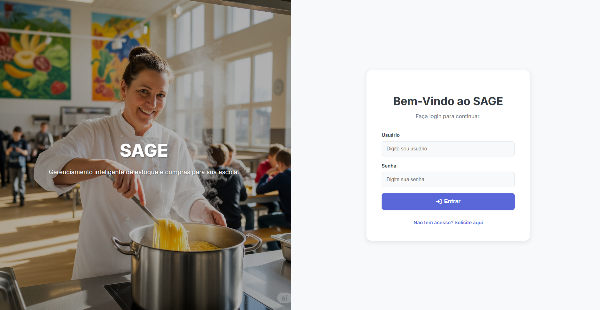
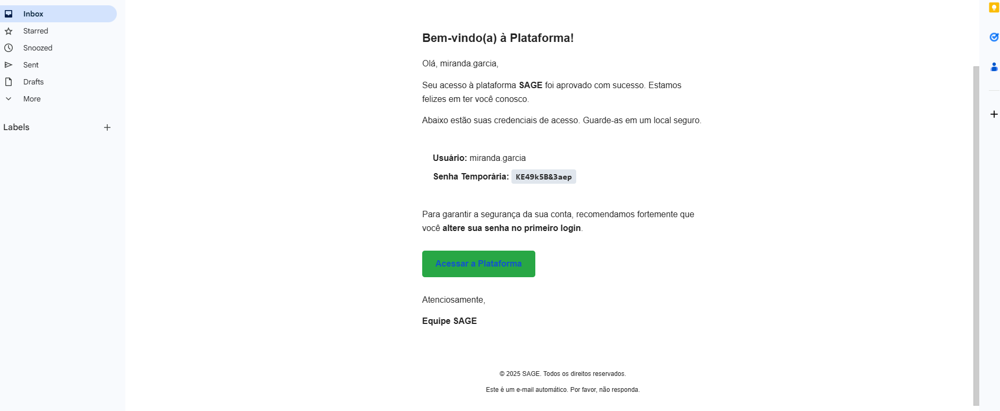
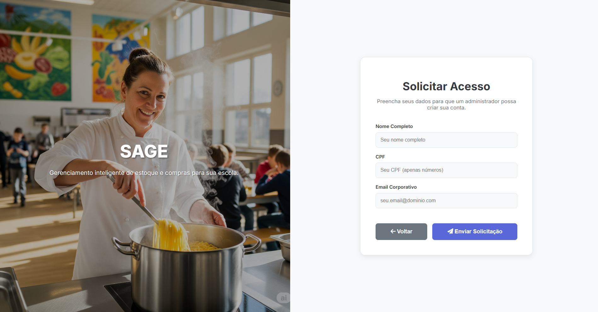

# 🥗 Plataforma SAGE – Gestão de Cantinas Escolares

A **Plataforma SAGE** é uma aplicação **full-stack** desenvolvida para modernizar a gestão de cantinas escolares. Nascida como tema de um hackathon acadêmico, foi transformada em um projeto completo com foco em automação de processos, controle de estoque e tomada de decisão baseada em dados.

## 📸 Visão Geral do Projeto


*Exemplo da tela de login com autenticação segura.*


*Email Enviado para usuarios aprovados*


*Tela de solicitacao de cadastro com envio automático de credenciais via e-mail.*

## 📌 Funcionalidades Principais

- **Gestão de Acesso Segura:**  
  Cadastro e aprovação de usuários com três níveis de permissão (`User`, `Admin`, `Master`). Envio automático de credenciais via e-mail com [MailKit](https://github.com/jstedfast/MailKit).

- **Fluxo de Compras Automatizado:**  
  Solicitações de compra são aprovadas pelo `Admin` ou escaladas automaticamente para o `Master`, caso ultrapassem um valor configurável.

- **Dashboards Dinâmicos:**  
  Visualização gráfica de estoque (incluindo **Curva ABC**) e análises financeiras (receitas vs. despesas), desenvolvidos com **Chart.js**.

- **Arquitetura Limpa:**  
  Backend construído com princípios da **Clean Architecture**, garantindo escalabilidade, manutenibilidade e testes mais fáceis.

## ⚙️ Tecnologias Utilizadas

### 🖥️ Backend
- [.NET 8](https://dotnet.microsoft.com/en-us/download/dotnet/8.0)
- ASP.NET Core Web API
- Entity Framework Core
- JWT (Autenticação)
- BCrypt (Criptografia de senhas)
- SQL Server
- MailKit (Envio de e-mails)

### 💻 Frontend
- HTML5, CSS3 (com variáveis CSS)
- JavaScript (ES6+)
- Fetch API
- Chart.js

## 👤 Perfis de Usuário

- **User:** voltado para as cozinheiras da cantina (visualização e solicitações)
- **Admin:** supervisores e gestores (análise e aprovação de solicitações)
- **Master:** coordenação e diretoria (controle financeiro e administrativo)

## 🛠️ Como Rodar o Projeto Localmente

### Pré-requisitos

- [.NET 8 SDK](https://dotnet.microsoft.com/en-us/download)
- [Node.js](https://nodejs.org/) (caso precise usar pacotes JS no futuro)
- SQL Server instalado
- Visual Studio / VS Code

### Clonando o Repositório

```bash
git clone [https://github.com/seu-usuario/SagePlataform.git](https://github.com/seu-usuario/SagePlataform.git)
cd SagePlataform
